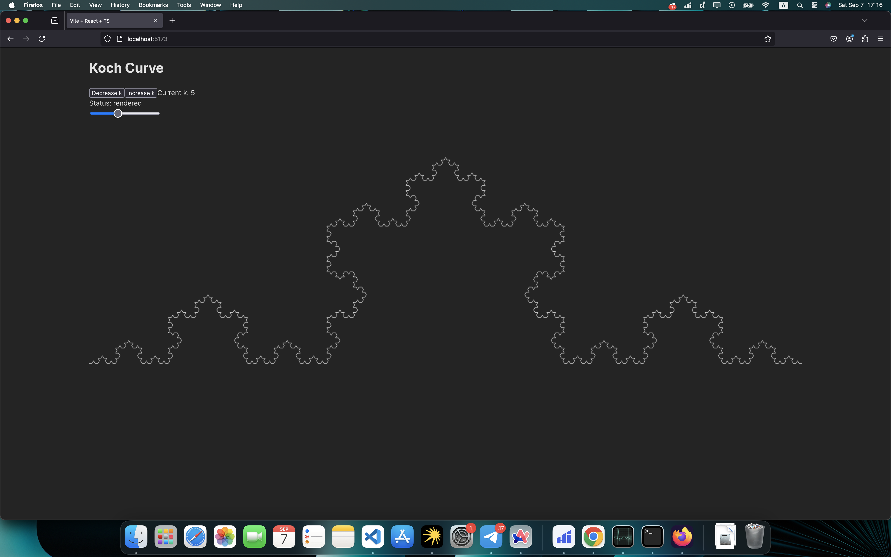

# The Koch Curve with Web Worker and WebAssembly rendering
An example of rendering a fractal (The Koch curve) that uses C++ code to calculate the coordinates, compiles it into WebAssembly using `emscripten`, runs it in Web Worker, and there renders segments based on the resulting coordinates using `OffscreenCanvas`.

## How to build
Install emscripten to compile C++ code to WebAssembly:
```
brew install emscripten
```

Compile C++ code:

```bash
emcc koch.cpp -s EXPORTED_FUNCTIONS="['_generateKochCurve', '_malloc', '_free']" -o koch.js -s MODULARIZE=1 -s EXPORT_ES6=1 -s ALLOW_MEMORY_GROWTH=1 -s MAXIMUM_MEMORY=4GB --emit-tsd koch.d.ts -O3 -fsanitize=address
```
Params:
- `koch.cpp` - path to the file
- `-s EXPORTED_FUNCTIONS="['_generateKochCurve', '_malloc', '_free']"` - export `generateKochCurve` function and C `malloc` and `free`
- `-o koch.js` - path to the output JS file
- `-s MODULARIZE=1` - wrapping the generated WebAssembly code inside a function (a module factory function)
- `-s EXPORT_ES6=1` - export to ES module
- `-s ALLOW_MEMORY_GROWTH=1 -s MAXIMUM_MEMORY=4GB` - allow to use 4GB of RAM. That's the maximum, because WASM uses 32-bits pointers
- `--emit-tsd koch.d.ts` - generate module declaration for TypeScript
- `-O3` - enable O3 C++ optimizations (release build)
- `-fsanitize=address` - additional memory leakage checks

Move `/src/wasm/koch.wasm` file to `/public/`

Run the web application:
```bash
npm run dev
```
## Screenshots

